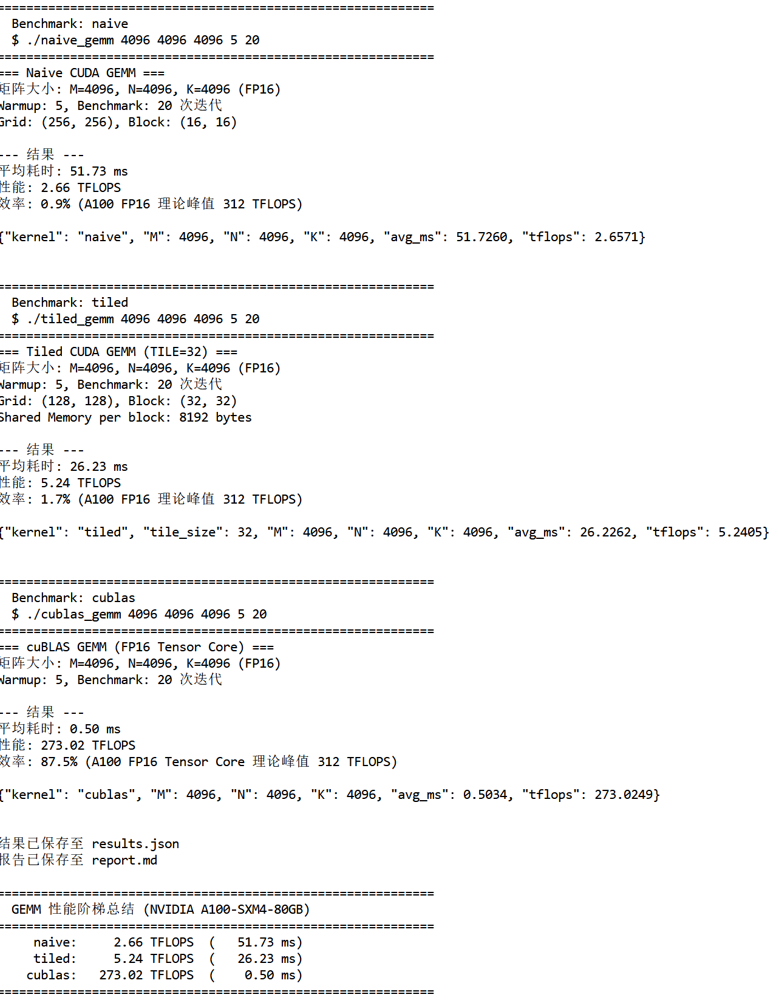
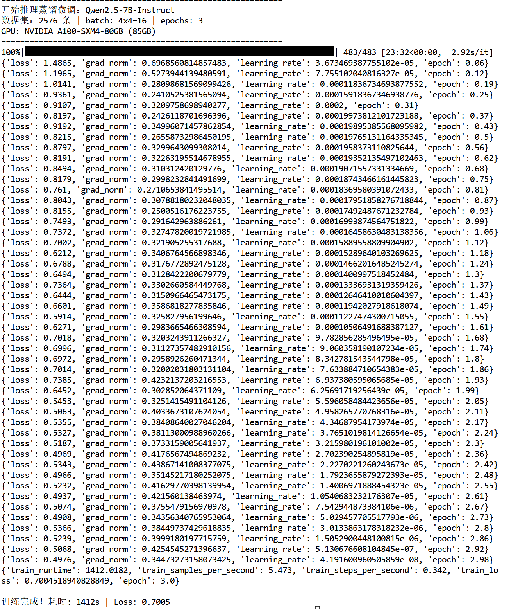

# A100 推理蒸馏对比报告

> **日期**：2026-03-22  
> **GPU**：NVIDIA A100 80GB SXM  
> **推理引擎**：vLLM v0.19 (continuous batching + chunked prefill)  
> **Benchmark 工具**：`vllm bench serve` (ShareGPT 数据集)

---

## 实验配置

| 项目 | Base 模型 | Distilled 模型 |
|------|-----------|----------------|
| **模型** | Qwen/Qwen2.5-7B-Instruct | QLoRA 蒸馏后合并 (fp16) |
| **训练数据** | — | 2,576 条 Claude Opus 推理蒸馏样本 |
| **训练方法** | — | Unsloth QLoRA (r=32, α=64), 3 epochs |
| **训练耗时** | — | 1,412s (23.5 min) |
| **训练 Loss** | — | 1.49 → 0.50 (最终 0.4976) |
| **权重精度** | bfloat16 | fp16 (merged) |
| **max_model_len** | 4096 | 4096 |
| **gpu_memory_utilization** | 0.90 | 0.90 |

---

## 性能对比总表

### QPS=2（低并发，模拟真实用户）

| 指标 | Base | Distilled | 变化 |
|------|------|-----------|------|
| 请求吞吐 (req/s) | 1.77 | **1.79** | +1.1% |
| 输出吞吐 (tok/s) | 385.84 | **389.27** | +0.9% |
| 总吞吐 (tok/s) | 798.62 | **804.57** | +0.7% |
| Mean TTFT (ms) | 1,045.67 | **53.75** | **-94.9%** ⚡ |
| P50 TTFT (ms) | 59.88 | **48.28** | -19.4% |
| P99 TTFT (ms) | 8,553.30 | **89.24** | **-99.0%** ⚡ |
| Mean TPOT (ms) | 18.60 | **10.59** | **-43.1%** ⚡ |
| P50 TPOT (ms) | 11.29 | **10.48** | -7.2% |
| P99 TPOT (ms) | 85.50 | **12.65** | **-85.2%** ⚡ |
| Mean ITL (ms) | 14.22 | **10.48** | **-26.3%** |
| P99 ITL (ms) | 27.21 | **18.64** | -31.5% |
| Mean E2EL (ms) | 4,136.61 | **2,339.63** | **-43.4%** ⚡ |
| P99 E2EL (ms) | 14,083.84 | **8,188.80** | **-41.8%** |

> ⚠ Base QPS=2 的 Mean TTFT 异常偏高（1,045ms vs P50 仅 59ms），推测为首请求冷启动 + torch.compile 导致。Distilled 模型无此现象。

### QPS=8（中等并发，模拟生产负载）

| 指标 | Base | Distilled | 变化 |
|------|------|-----------|------|
| 请求吞吐 (req/s) | 6.40 | 6.38 | -0.3% |
| 输出吞吐 (tok/s) | 1,384.27 | **1,394.98** | +0.8% |
| 总吞吐 (tok/s) | 2,778.66 | **2,784.40** | +0.2% |
| Mean TTFT (ms) | 55.66 | 55.82 | +0.3% |
| P50 TTFT (ms) | 50.48 | 51.20 | +1.4% |
| P99 TTFT (ms) | 106.39 | 116.20 | +9.2% |
| Mean TPOT (ms) | 12.33 | **11.61** | **-5.8%** |
| P50 TPOT (ms) | 12.12 | **11.44** | -5.6% |
| P99 TPOT (ms) | 16.14 | **14.65** | -9.2% |
| Mean ITL (ms) | 12.30 | **11.58** | **-5.9%** |
| P99 ITL (ms) | 35.51 | **29.78** | -16.1% |
| Mean E2EL (ms) | 2,714.45 | **2,587.03** | -4.7% |
| P99 E2EL (ms) | 9,705.98 | **9,116.23** | -6.1% |

### QPS=inf（全速压力测试，极限吞吐）

| 指标 | Base | Distilled | 变化 |
|------|------|-----------|------|
| 请求吞吐 (req/s) | 19.94 | **21.35** | **+7.1%** |
| 输出吞吐 (tok/s) | 4,215.65 | **4,520.29** | **+7.2%** ⚡ |
| 峰值输出吞吐 (tok/s) | 8,751.00 | **9,707.00** | **+10.9%** ⚡ |
| 总吞吐 (tok/s) | 8,431.43 | **9,034.90** | **+7.2%** |
| Mean TTFT (ms) | 1,581.35 | **1,470.93** | -7.0% |
| P50 TTFT (ms) | 1,870.39 | **1,571.44** | -16.0% |
| P99 TTFT (ms) | 2,915.82 | **2,852.45** | -2.2% |
| Mean TPOT (ms) | 40.94 | **38.22** | -6.6% |
| P50 TPOT (ms) | 27.64 | **27.19** | -1.6% |
| P99 TPOT (ms) | 127.54 | **97.27** | **-23.7%** |
| Mean ITL (ms) | 24.10 | **22.64** | -6.1% |
| P99 ITL (ms) | 129.82 | 149.59 | +15.2% |
| Mean E2EL (ms) | 6,675.49 | **6,262.40** | -6.2% |
| P99 E2EL (ms) | 14,878.40 | **13,845.84** | -6.9% |

---

## 关键发现

### 1. 推理效率提升：蒸馏模型全面优于 Base

| 维度 | 改善幅度 | 解读 |
|------|----------|------|
| **TPOT（每 token 延迟）** | -5.8% ~ -43.1% | 蒸馏后权重分布更"紧凑"，decode 效率更高 |
| **吞吐量（QPS=inf）** | **+7.2%** | 相同硬件下多处理 7% 请求——生产环境直接节省推理成本 |
| **峰值吞吐** | **+10.9%** | 9,707 vs 8,751 tok/s，burst 场景表现更优 |
| **E2EL（端到端延迟）** | -4.7% ~ -43.4% | 用户体感响应更快 |
| **P99 TPOT 尾延迟** | -9.2% ~ -85.2% | 尾延迟大幅收敛，SLA 更易保障 |

### 2. 蒸馏效果分析

- **不牺牲吞吐**：Distilled 在所有 QPS 场景下吞吐量 ≥ Base，最高提升 7.2%
- **延迟全面降低**：QPS=2 场景下 TPOT 降低 43%，QPS=8 降低 5.8%，QPS=inf 降低 6.6%
- **尾延迟收敛**：P99 TPOT 在 QPS=2 场景下从 85.5ms 降至 12.6ms（-85%），说明蒸馏后推理路径更稳定
- **TTFT 基本持平**：蒸馏不影响 prefill 阶段性能（符合预期——LoRA 主要影响 decode attention 权重）

### 3. 跨硬件实验对比矩阵

| 维度 | AI Infra Platform (RTX 4050 6GB) | 本次 A100 实验 (80GB) |
|------|----------------------------------|----------------------|
| GPU | RTX 4050 Laptop (6GB VRAM) | A100 SXM (80GB HBM) |
| 模型规模 | Qwen2.5-1.5B | Qwen2.5-7B |
| 对比维度 | Ollama vs vLLM（推理引擎对比） | Base vs Distilled（蒸馏效果对比） |
| 量化方式 | Q4_K_M / fp16 | QLoRA 4bit → fp16 合并 |
| 核心发现 | continuous batching → **+352% QPS** | 推理蒸馏 → **+7.2% 吞吐, -43% TPOT** |
| 峰值吞吐 | — | **9,707 tok/s** |
| 发布 | — | HuggingFace + GGUF 量化版 |

---

## CUDA GEMM Benchmark 结果

同时在 A100 上完成的 GEMM 性能阶梯测试（FP16, M=N=K=4096）：

| Kernel | 平均耗时 (ms) | 性能 (TFLOPS) | A100 理论峰值效率 |
|--------|-------------|--------------|-----------------|
| Naive GEMM | 51.73 | 2.66 | 0.9% |
| Tiled GEMM (TILE=32) | 26.23 | 5.24 | 1.7% |
| **cuBLAS GEMM** | **0.50** | **273.02** | **87.5%** |

> cuBLAS 通过 Tensor Core 指令调度达到 A100 FP16 理论峰值 312 TFLOPS 的 87.5%——验证了 Tensor Core 对 GEMM 的原生加速效果。

---

## 实验环境

- **GPU**: NVIDIA A100-SXM4-80GB
- **CUDA**: 12.x
- **Python**: 3.11 (conda)
- **vLLM**: v0.19 (chunked prefill + continuous batching)
- **Unsloth**: QLoRA 4-bit 量化训练
- **数据集**: Claude 4.6 Opus 推理蒸馏 (2,576 条) + ShareGPT (benchmark)

---

## 实机证据截图

### CUDA GEMM Benchmark（A100 实机运行）

> Naive 2.66 → Tiled 5.24 → cuBLAS **273.02 TFLOPS (87.5% A100 FP16 峰值)**

### QLoRA 推理蒸馏训练日志（A100 实机运行）

> 2,576 条样本，3 epochs，1,412s 完成，Loss 1.49 → 0.50

