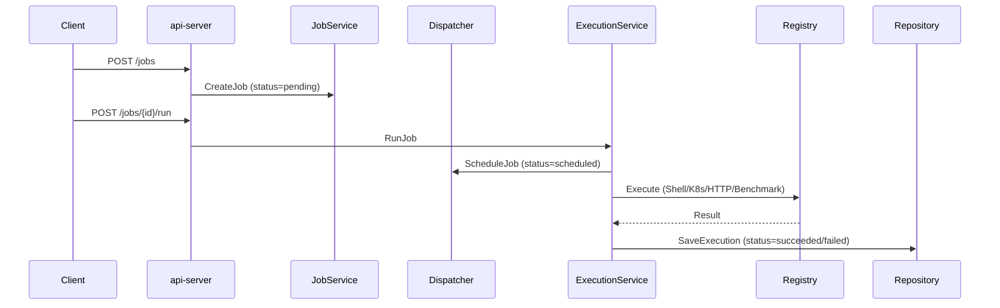

# 系统设计

## 目标

面向 AI 训练、推理和压测任务的作业编排平台，内置 Go 并发压测客户端。

核心能力：

- API 接收 training / inference / benchmark 三种任务
- 调度器根据优先级选择可执行任务
- Worker 执行 shell 命令、生成 K8s manifest、发起 HTTP 请求或运行内置压测
- 服务记录状态、执行历史、metrics 与 trace timeline

## 核心组件

- `JobService`: 创建、查询、取消、重试
- `Dispatcher`: `pending/retrying → scheduled`，优先级队列排序
- `ExecutionService`: `scheduled → running → succeeded/failed/retrying`
- `MemoryStore`: 默认内存持久化
- `MySQL Store`: 可选 `STORE_BACKEND=mysql`
- `BenchmarkExecutor`: 从 Job metadata 读取压测配置，调用 `internal/benchmark` 执行
- `Metrics`: Prometheus 文本指标（submit/schedule/run/success/fail/retry/cancel + runtime）
- `Tracer`: submit → schedule → run 时间线

## 数据流

## 执行器矩阵

| Executor | 用途 | 实际行为 |
|---|---|---|
| `shell` | 本地命令执行 | `os/exec.Command` |
| `k8s-dry-run` | K8s manifest 生成 | 构建 Job YAML，不提交 |
| `k8s-apply` | 真实 K8s 提交 | 需 `ALLOW_K8S_APPLY=true` |
| `http` | HTTP 请求执行 | 发起 HTTP 调用 |
| `benchmark` | 推理服务压测 | 调用 `internal/benchmark.Run()` |

## 设计取舍

- 内存 store 为默认路径，零外部依赖即可本地验证
- `STORE_BACKEND=mysql` 预留数据库切换路径
- `k8s-dry-run` 明确只生成 manifest，不伪装成真实集群
- benchmark executor 通过 Job metadata 传入配置，执行结果写入 execution logs
- tracing 使用内存事件流，后续可替换为 OpenTelemetry exporter
